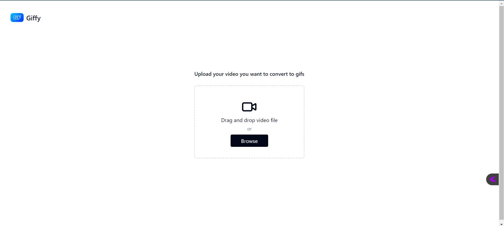

# Giffy 1.0.0

## Description

Application to create gifs from video files easily and smoothly.

## Live preview of application

- Home page of application
  
- Gif generating page
  

## How to use the application

### Development setup

- It contains separate client and server modules for efficient generation of gifs.
- Client module is created using Vite + React + TS. Requires environment variable to work.
    - `VITE_GIFFY_API_URL`
    - `VITE_PORT`
    - `VITE_HOST`
    - `VITE_API_URL`
- Server module is an express server and for data persistence json-server is used which clears itself every hour.
    - Generated gifs are uploaded on Cloudinary.
    - Environment variables required are
        - `HOST`
        - `PORT`
        - `OPENAI_API_KEY`
        - `UPLOAD_FOLDER`
        - `REDIS_HOST`
        - `REDIS_PORT`
        - `JSON_SERVER_PORT`
        - `JSON_DB_URL`
        - `CLOUDINARY_CLOUD_NAME`
        - `CLOUDINARY_API_KEY`
        - `CLOUDINARY_API_SECRET`

### To run the server and client

```shell
docker compose up
```

- `Make sure redis is up before running it`
- After running the docker command UI of the application can be accessed at
  `https:<host ip>:<port>/`

## For running things locally

- To run client

```shell
cd client && npm run dev
```

- To run the server

```shell
cd server && npm run dev
```

- To run json-server for temporary acting as database

```shell
cd server && npx json-server db.json --port <some port>
```